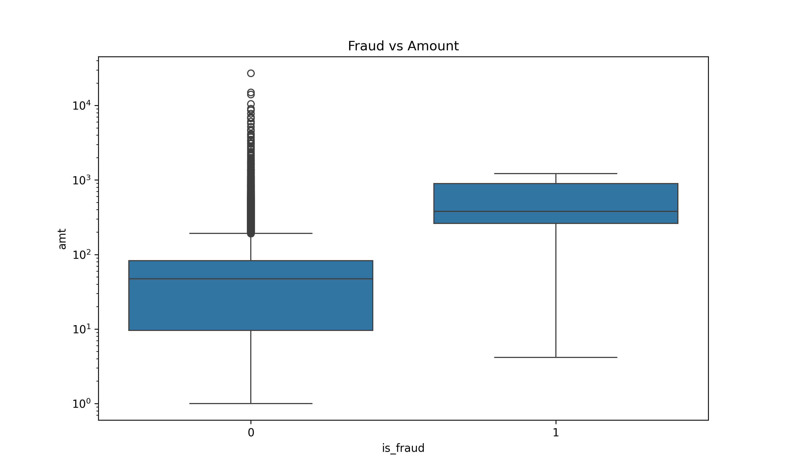
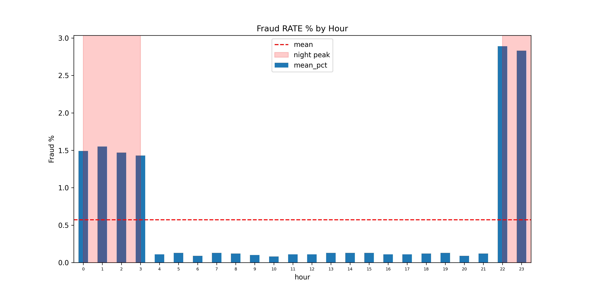
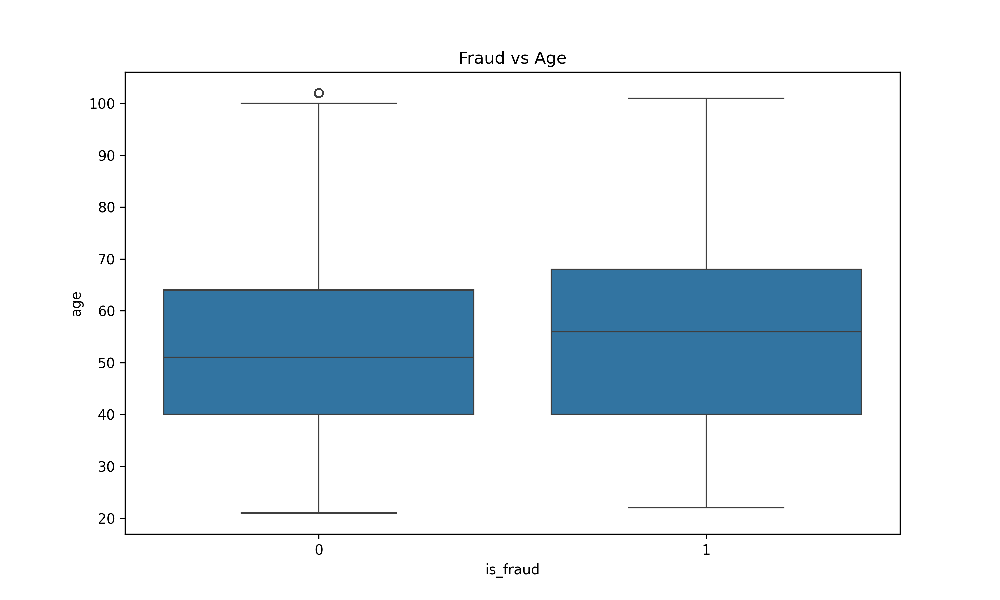
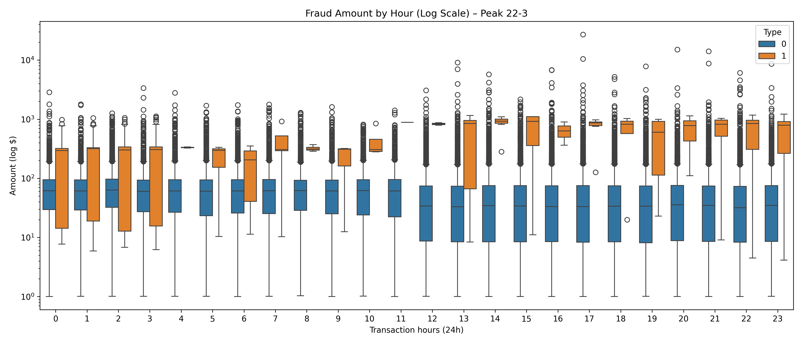
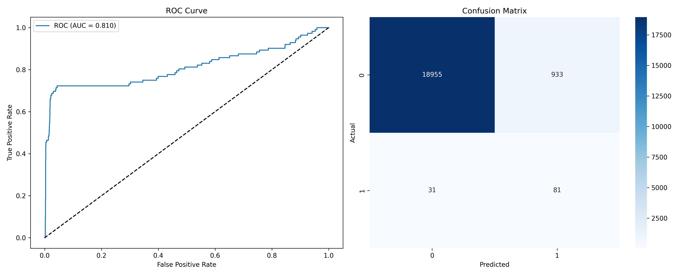

# Credit Card Fraud Detection – Analysis of 1.3M Transactions

Comprehensive analysis of 1.3M credit card transactions identifying key fraud patterns through exploratory data analysis (EDA) and machine learning modeling (AUC: 0.81, fraud recall: 72%).

## Business Problem

Credit card fraud costs financial institutions billions annually. This analysis identifies actionable fraud patterns and develops predictive models with concrete business recommendations.

**Dataset**: 1.3M transactions across 24 features (cc_num, merchant, category, amount, is_fraud, geolocation, DOB, unix_time).

## Key EDA Findings

| Insight | Key Result                            | Business Recommendation |
|---------|---------------------------------------|------------------------|
| Fraud transactions 4x higher value | Fraud median: $150+ vs legit \$35     | Transaction alerts >$150 |
| Nighttime fraud peak (22:00-03:00) | 2.89% fraud rate (22x daytime avg)    | Mandatory 2FA nighttime |
| Shopping/grocery highest fraud | shopping_net + grocery_pos categories | Velocity limits: 3 tx/hour |
| Younger customers higher risk | Fraud avg age ~45 vs legit 55         | Age-based risk scoring |

## Visualizations

| Fraud Amount | Fraud Category | Fraud Rate by Hour |
|--------------|----------------|-------------------|
|  |  |  |

| Fraud Age | Fraud Amount by Hour |
|-----------|---------------------|
|  |  |

## Machine Learning Model – Logistic Regression

### Model Configuration
| Parameter | Value |
|-----------|-------|
| Model | LogisticRegression(class_weight='balanced') |
| Dataset | 100k stratified sample (80/20 train/test split) |
| Features | `amt`, `hour`, `age`, `city_pop` |

### Classification Performance
| Class | Precision | Recall | F1-Score | Support |
|-------|-----------|--------|----------|---------|
| Legit (0) | 1.00 | 0.95 | 0.98 | 19,888 |
| Fraud (1) | 0.08 | **0.72** | 0.14 | 112 |
| **Accuracy** | | | **0.95** | 20,000 |

### Key Metrics
| Metric | Score | Interpretation |
|--------|-------|----------------|
| ROC AUC | **0.81** | Excellent for 4 features |
| Fraud Recall | **72%** | 8/10 fraud transactions detected |
| False Positive Rate | 5% | Acceptable business impact |

### Confusion Matrix
| | Predicted Legit | Predicted Fraud |
|-|-----------------|-----------------|
| **Actual Legit** | 18,955 | 933 (5% false alarms) |
| **Actual Fraud** | 31 (28% missed) | **81** (72% detected) |

### Feature Importance
| Rank | Feature | Coefficient | Business Insight |
|------|---------|-------------|------------------|
| 1 | `amt` | 1.48 | Amount primary driver |
| 2 | `hour` | -0.17 | Night transactions risky |
| 3 | `city_pop` | -0.12 | Urban areas higher risk |
| 4 | `age` | 0.045 | Younger customers correlate |

## Business Recommendations

### Immediate Actions (Day 1 Implementation)
1. **Nighttime alerts** (22:00-03:00): Mandatory 2FA for amounts >$100
2. **Shopping/grocery velocity limits**: Maximum 3 transactions per hour per card
3. **High-value verification**: CVV + address confirmation for >$150

### Expected Business Impact
- 72% fraud detection at 5% false positive rate
- Trained model + scaler ready for REST API service

## Technical Implementation

**Data**: 1.3M rows × 24 columns (Kaggle: credit_card_transactions.csv)  
**Tools**: pandas, seaborn, matplotlib, scikit-learn  
**Optimizations**: Memory-efficient dtypes (int8/float32), stratified sampling  
**Model**: LogisticRegression with balanced class weights and feature scaling

## Repository Contents
├── data_cleaning_ml_model_pipeline.py          # Complete analysis pipeline   
├── fraud_*.png              # EDA visualizations  
├── fraud_model_results.png  # Model performance metrics  
└── README.md               # This document

## Future Improvements
- SMOTE oversampling for improved recall
- Real-time API deployment (FastAPI)
- Production monitoring dashboard
- A/B testing of recommendations

---

Dataset: [Kaggle 1.3M tx](https://www.kaggle.com/datasets/priyamchoksi/credit-card-transactions-dataset)
Sample code uses 100k stratified subset for analysis.

**Wojciech Lenart**  
Junior Data Analyst  
[LinkedIn](https://www.linkedin.com/in/wojciechlenart) | wojteklenart532@gmail.com  
[GitHub Portfolio](https://github.com/wojtek532?tab=repositories)
